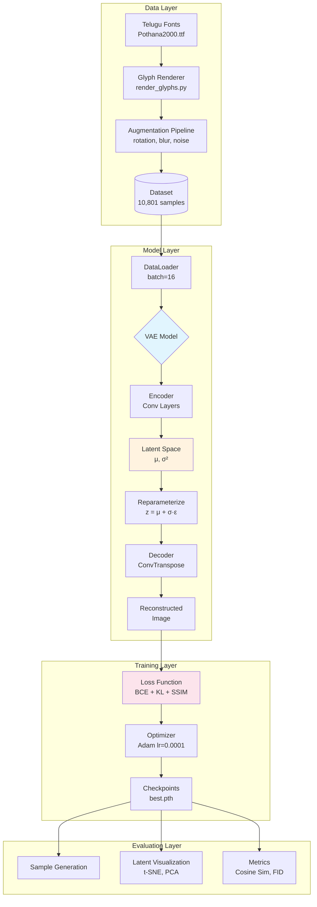
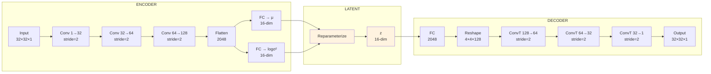
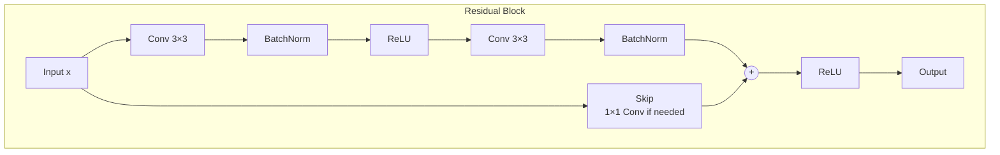
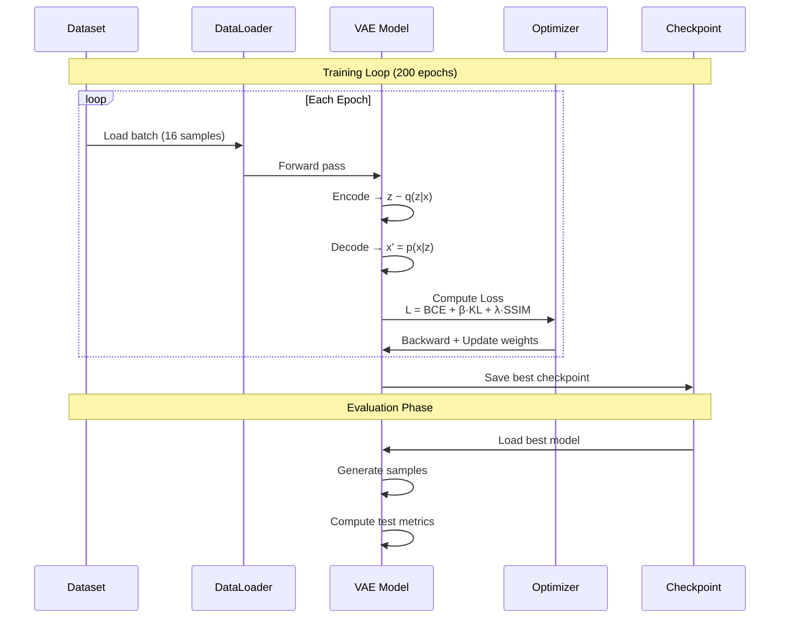
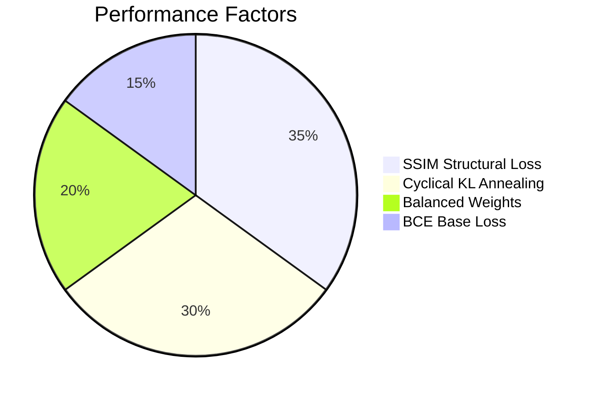
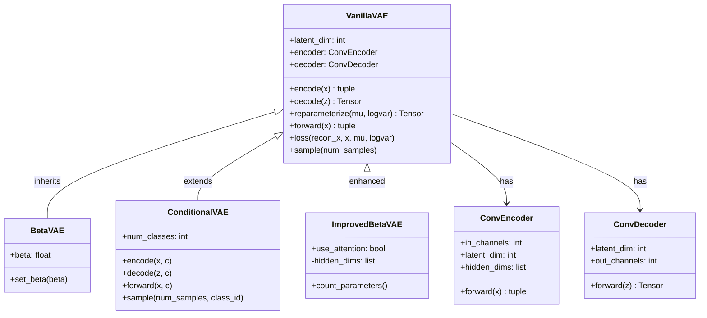

<p align="center">
  <h1 align="center">🔤 Telugu Glyph Generation using VAEs</h1>
  <p align="center">
    <strong>Variational Autoencoders for Printed Telugu Character Synthesis</strong>
  </p>
  <p align="center">
    <a href="#-quick-start">Quick Start</a> •
    <a href="#-model-architectures">Models</a> •
    <a href="#-results">Results</a> •
    <a href="#-documentation">Docs</a>
  </p>
</p>

<p align="center">
  
  
  
  
</p>

---

## 📋 Abstract

This research project implements and compares multiple **Variational Autoencoder (VAE)** architectures for generating high-quality printed **Telugu script** characters. Telugu, spoken by over 80 million people, has a complex Unicode structure with 72+ characters including vowels, consonants, and diacritical marks.

We evaluate four VAE variants with six different loss function configurations and demonstrate that **SSIM + Cyclical KL Annealing** achieves the best reconstruction quality with **0.9917 cosine similarity** on the test set.

**Key Contributions:**
- Systematic comparison of VAE architectures for Telugu character generation
- Novel loss function combination (SSIM + Cyclical KL Annealing)
- Open-source dataset and reproducible training pipeline

---

## 🏗️ System Architecture



---

## 🧠 Model Architectures

### Architecture Comparison

| Model | Encoder | Latent Dim | Key Feature | Parameters |
|-------|---------|------------|-------------|------------|
| **VanillaVAE** | 3 Conv | 16 | Standard VAE | ~200K |
| **β-VAE** | 3 Conv | 16 | Weighted KL (β=4) | ~200K |
| **Conditional VAE** | 3 Conv + Embed | 16 | Class conditioning | ~250K |
| **Improved β-VAE** | 4 Residual | 16 | Skip connections + Attention | ~500K |

### Encoder-Decoder Architecture



### Improved β-VAE with Residual Blocks



---

## 📊 Training Pipeline



---

## 📈 Results

### Performance Summary

| Approach | Loss Function | Test Cosine Similarity | Rank |
|----------|---------------|------------------------|------|
| Baseline β-VAE | BCE + 4·KL | 0.9889 | 2nd |
| **SSIM + KL Annealing** | BCE + 0.3·SSIM + cyclical_KL | **0.9917** | 🥇 **1st** |
| Combined Loss | L1 + SSIM + Focal + Cosine + KL | 0.9823 | 3rd |

### Why SSIM + KL Annealing Wins



**Key Insights:**
- ✅ **SSIM** preserves Telugu character stroke structure
- ✅ **Cyclical annealing** prevents posterior collapse
- ✅ **Moderate β** allows good reconstruction without over-regularization
- ❌ **Too many losses** (Approach 3) dilutes gradients

---

## 📁 Project Structure

```
vae_project/
├── 📂 models/                      # VAE implementations
│   ├── vae.py                      # VanillaVAE, BetaVAE, cVAE
│   ├── improved_vae.py             # Residual blocks + Attention
│   ├── networks.py                 # Encoder/Decoder networks
│   └── losses.py                   # Loss functions
│
├── 📂 scripts/                     # Training & evaluation
│   ├── train.py                    # Main training script
│   ├── generate_samples.py         # Sample generation
│   ├── latent_visualizer.py        # t-SNE, UMAP, traversals
│   └── evaluate.py                 # Evaluation metrics
│
├── 📂 configs/                     # YAML configurations
│   └── beta_vae_baseline.yaml
│
├── 📂 data/                        # Datasets
│   ├── Pothana2000.ttf             # Telugu font
│   ├── Vowel_Dataset/              # 6 vowel classes
│   └── metadata.csv                # Dataset metadata
│
├── 📂 experiments/                 # Experiment outputs
├── 📂 results/                     # Metrics & reports
├── 📂 checkpoints/                 # Model weights
│
├── 📄 DOCUMENTATION.md             # Comprehensive docs
├── 📄 train_vowel_experiments.py   # Main experiment script
└── 📄 README.md                    # This file
```

---

## 🚀 Quick Start

### Prerequisites

```bash
# Python 3.8+
pip install torch torchvision matplotlib pandas scikit-learn \
    opencv-python pillow tqdm seaborn
```

### Train a Model

```bash
# Approach 1: Baseline β-VAE
python train_vowel_experiments.py --approach 1 --epochs 200

# Approach 2: SSIM + KL Annealing (BEST)
python train_vowel_experiments.py --approach 2 --epochs 200

# Approach 3: Combined Loss
python train_vowel_experiments.py --approach 3 --epochs 200

# All approaches
python train_vowel_experiments.py --approach 0
```

### Generate Samples

```bash
python scripts/generate_samples.py \
    --model_path checkpoints/vowel_approach_2/best.pth \
    --model_type beta_vae \
    --latent_dim 16 \
    --num_samples 100 \
    --output_dir results/generated_samples
```

### Visualize Latent Space

```bash
python scripts/latent_visualizer.py \
    --model_path checkpoints/vowel_approach_2/best.pth \
    --data_path data/Vowel_Dataset \
    --latent_dim 16
```

---

## 📊 Class Diagram



---

## 📚 Loss Functions

| Loss | Formula | Use Case |
|------|---------|----------|
| **BCE** | `-∑[x·log(x') + (1-x)·log(1-x')]` | Pixel reconstruction |
| **KL Divergence** | `-0.5·∑(1 + logσ² - μ² - σ²)` | Latent regularization |
| **SSIM** | `1 - SSIM(x, x')` | Structural similarity |
| **Focal BCE** | `α(1-p)^γ · BCE` | Hard sample mining |
| **L1/MAE** | `\|x - x'\|` | Edge preservation |
| **Cosine** | `1 - cos(x, x')` | Feature alignment |

---

## 📖 Documentation

For comprehensive technical documentation, see:

📄 **[DOCUMENTATION.md](./DOCUMENTATION.md)** - Full research documentation including:
- Problem statement & scope
- Dataset description & statistics
- Model architecture details
- Loss function analysis
- Experimental methodology
- Detailed results analysis
- Conclusions & future work

---

## 🎯 Future Work

- [ ] Implement VQ-VAE for discrete latents
- [ ] Add more Telugu fonts (Vemana, Gautami)
- [ ] Compute FID scores
- [ ] Train OCR classifier for evaluation
- [ ] Extend to handwritten characters
- [ ] GPU training optimization

---

## 📝 Citation

If you use this code in your research, please cite:

```bibtex
@misc{pamidi2025teluguvae,
  title={Telugu Glyph Generation using Variational Autoencoders},
  author={Pamidi, Rohit},
  year={2025},
  institution={Indian Institute of Technology},
  note={BTP Research Project}
}
```

---

## 👥 Contributors

- **Rohit Pamidi** - Primary Developer & Researcher
- **Faculty Advisor** - Project Guidance

---

## 📄 License

This project is for academic research purposes. Please cite if using this code or methodology.

---

<p align="center">
  <strong>🙏 Thank you for exploring Telugu VAE Generation!</strong>
</p>
